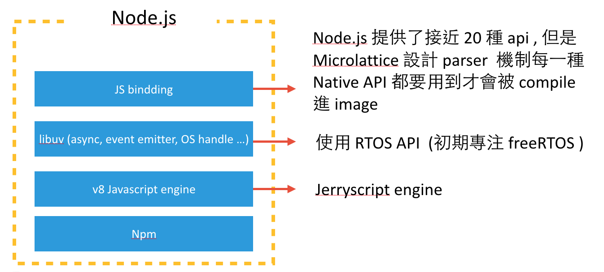
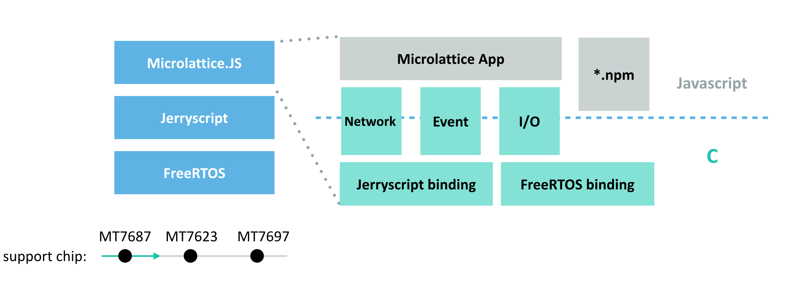
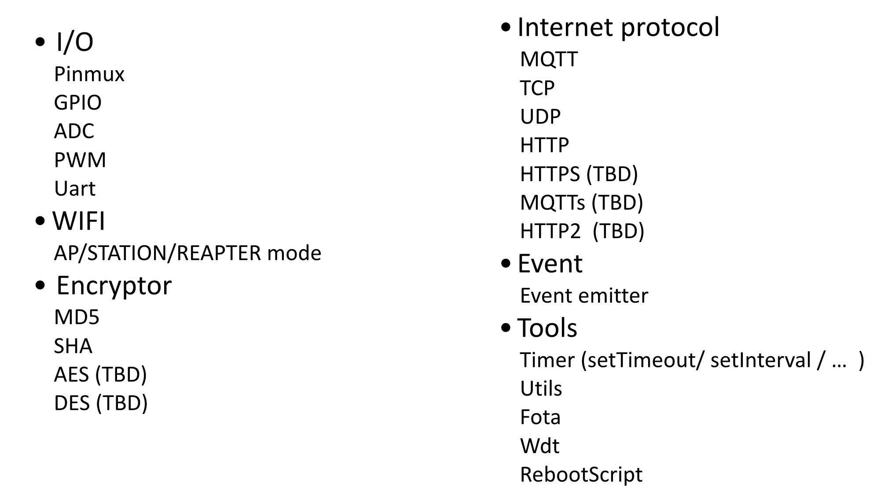
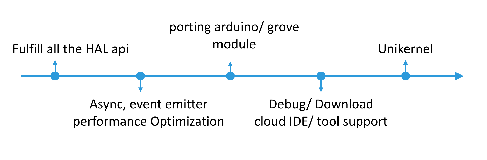

# About Microlattice.js

## Feature
* Platform for IoT device (especially: wifi + MCU) with javascript.
* Microlattice.js is adopting the similar coding style used in javascript community providing high performance like C.
* Everything you need like tools, modules, and engine core are modular designed.
* Providing standards for resolving the following issues you may encounter while developing embedded board:
  * Different MCU build tools.
  * Diverse in debug/download code.
  * License: dis-contribute limitation.
  * No common sharing project standard.
  * Existing JS total solution is not light-weighted enough, providing low performance comparing to C.
  * FreeRTOS does not have file system design.

## Difference with Node.js

## Microlattice.js Arch

## API list

## RoadMap
