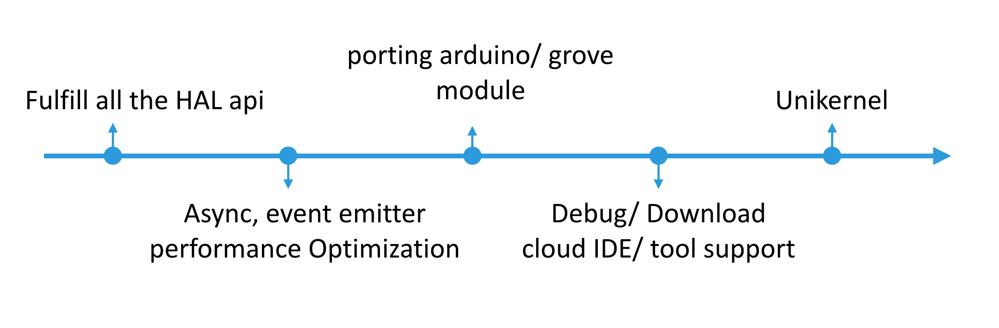

# 關於 Microlattice.js

## 命名精神

* 中文名：微晶格
* 英文意思：世界上最小最輕且非常堅固的金屬材料

## 設計理念
* 真正為 IoT device 所設計的 IoT 版的 Node.js.
* 針對 Javascript community 所熟悉的 coding style 追求接近 C 的效能.
* 每一個細節包含 tool, module, engine core 都是可以拆分重組.
* 提供標準解決以下開發 embedded board 常見問題:
  * MCU build tool 環境各家很不一致
  * Debug/ Download code 各家皆不一樣
  * LICENSE 問題：大部份廠商 SDK 皆有 dis-contribute 規範
  * 沒有共同的 sharing project 標準
  * 現成的 Js total solution 不夠輕量，不符合效能接近 C 
  * 大部份 RTOS 設計，沒有 filesystem 設計

## 與 Node.js 架構相較

## Microlattice.js 架構圖

## API list

## RoadMap

