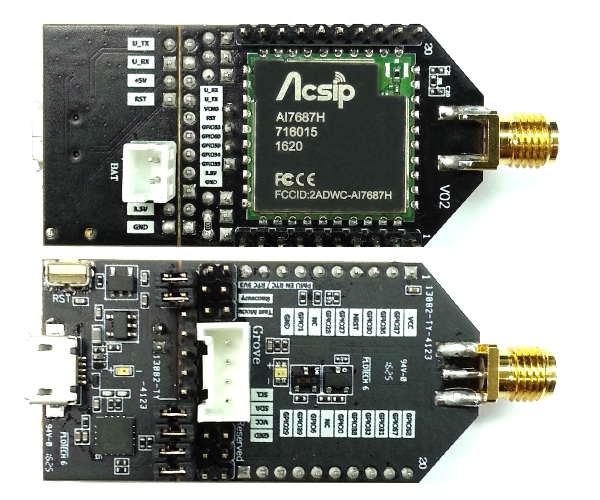

 # Acsip AI7687 開發板

## 圖片



## 使用說明

請務必先完成[此章節](/intro/create.md)，並創建好專案 

### 設定 FTDI download 相關的環境 
* 請在 `featureConfig.json` 多加上這兩行：

``` json
{
  "download_protocol": "xmodem",
  "download_port": "/dev/tty.usbserial-00001014B"
}
```

ps. 上述的 `/dev/tty.usbserial` 則是寫你的版子跟你電腦對接之 com port 

### 每次燒錄的步驟
* 在 index.js 寫好你的 app 後
* 請先確定沒有其他 Terminal 正在監聽你的 com port，有的話請關閉
* 將 jumper 插入此處，並且按一次 reset 鈕.
* 回到 Terminal 下: `npm run build` 
* 出現 `` 字樣時，按下版子上的 reset 鈕
* 出現 success! download 字樣時代表 download 成功!
* 開啟另外一個 Terminal 下 `minicom -D {Input your com port`, 例如: `minicom -D /dev/tty.usbserial-00001014B`
* 請拔起 jumper，並再按一次 reset 按鈕
* 這時候就會看到這個新開的 Terminal 上面出現相關的 debug 畫面囉!
 
* 
