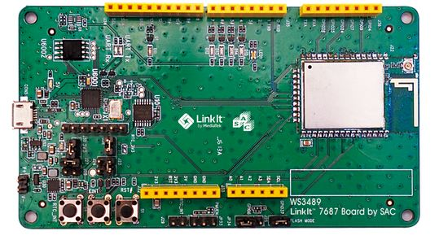

# 支持開發板清單

| 圖片 | 版子名稱 | debugger chip | 使用說明 |
| -- | -- | -- | -- |
| | [大聯大 7687 HDK](http://www.wpgholdings.com/news/detail/zhtw/program/20134) | mk20(mbed) | [看此說明](/boardlist/SAC.md) |
| | [Acsip AI7687](http://www.acsip.com.tw/index.php?action=products-detail&fid1=13&fid2=35&fid3=35&id=103)  | FTDI | [看此說明](/boardlist/acsip.md) |
